## Introduction

This project explores image filtering and analysis in both the **spatial domain** and **frequency domain**, as well as the effects of **Canny edge detection**.  

The main objectives include:

- Applying **Gaussian and derivative-of-Gaussian filters** to high-frequency and low-frequency images.  
- Observing the effects of **subsampling and anti-aliasing** on images in spatial and frequency domains.  
- Determining optimal **Canny edge detection thresholds** for different types of image content.  
- Generating visualizations that demonstrate the impact of these operations on image detail, edge preservation, and frequency content.

The report documents the results, visualizations, and observations for each step of the analysis.

## 1: Take two photographs

**High-Frequency Photograph (many edges and details):**  
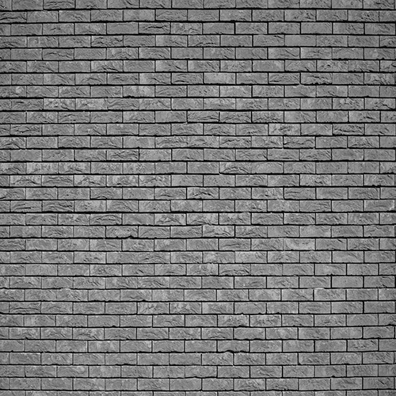

**Low-Frequency Photograph (mostly smooth regions):**  
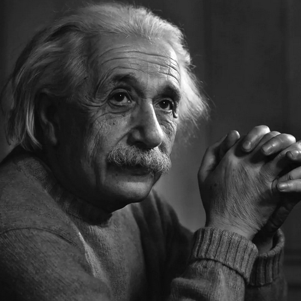

*Image Selection Rationale:* The brick wall image contains high-frequency content due to regular brick patterns, mortar lines, and textured surfaces. The portrait image contains predominantly low-frequency content with smooth skin tones and gradual shading, making it ideal for comparing frequency domain behaviors.

## 2: Compute frequency representations

**Frequency Magnitude of High-Frequency Photograph:**  
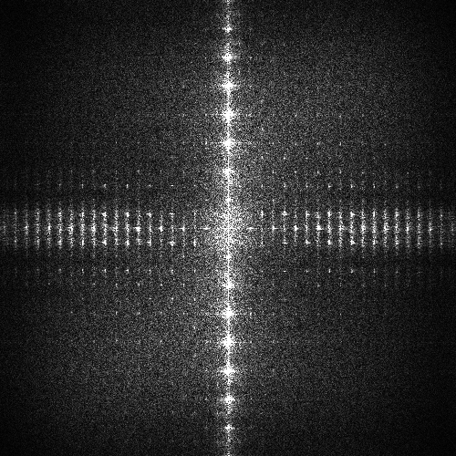

**Frequency Magnitude of Low-Frequency Photograph:**  

*Frequency Analysis:*
- **High-Frequency Image (Brick Wall):** The Fourier magnitude shows significant energy distributed toward the boundaries of the frequency domain, indicating strong high-frequency components. The diagonal patterns correspond to the directional brick edges in the spatial domain.
- **Low-Frequency Image (Portrait):** Energy is concentrated near the center (DC component) with rapid attenuation toward higher frequencies, confirming the smooth nature of the image. The faint circular patterns represent gradual shading transitions in the facial features.

## 3: Visualize kernels

**Gaussian Kernel Surface (σ=2.5):**  
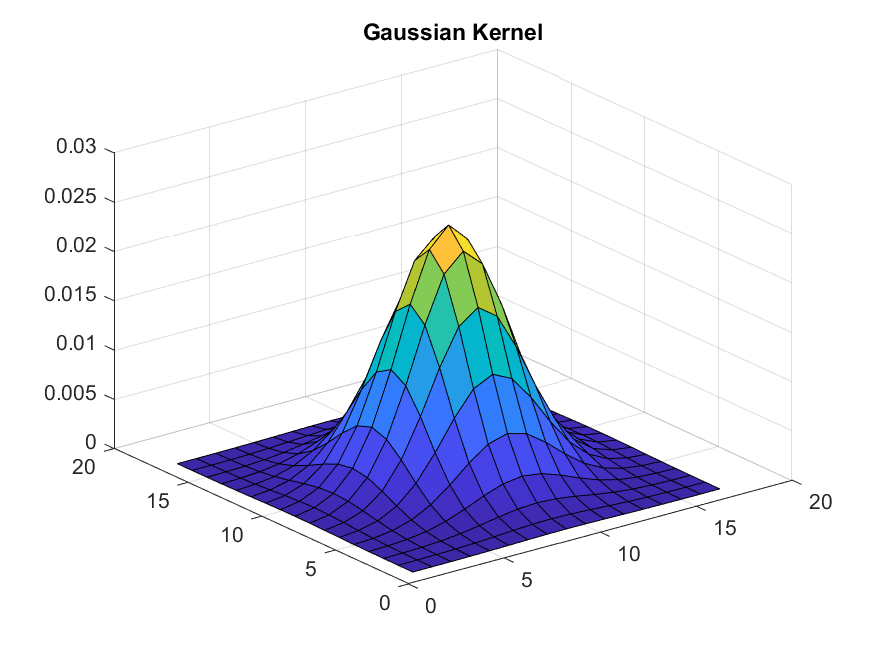

**Derivative-of-Gaussian Kernel Surface:**  
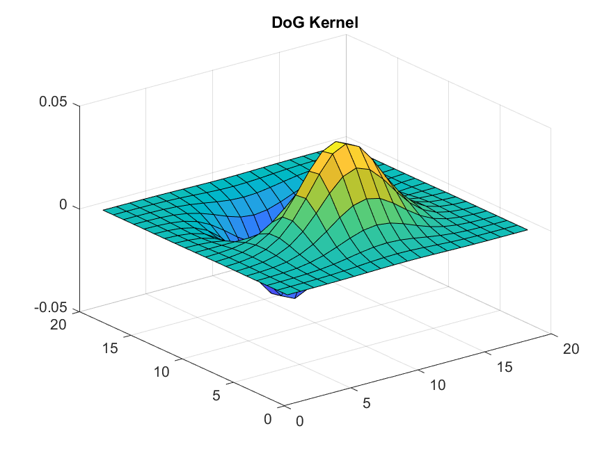

*Kernel Properties:*
- **Gaussian Kernel:** Acts as a low-pass filter with σ=2.5, chosen to provide noticeable smoothing while preserving overall structure. The kernel size (2⌈3σ⌉+1 = 15×15) ensures >99% of the Gaussian energy is captured.
- **Derivative-of-Gaussian:** Created by convolving Gaussian with Sobel operator, resulting in a band-pass filter that emphasizes edges while suppressing noise. The zero-crossing in the center provides the derivative property for edge detection.

**Filtered Images:**

- **High-Frequency Photograph filtered with Gaussian Kernel:**  
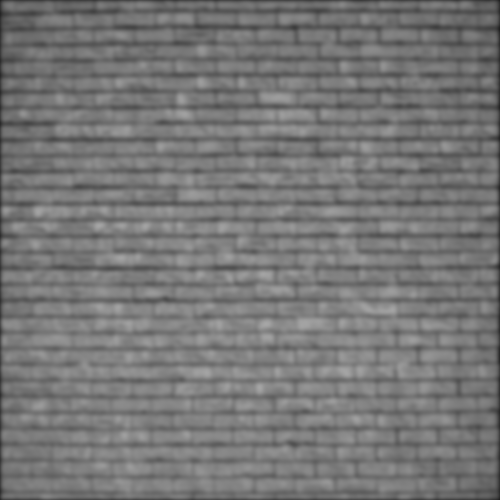

- **Frequency Magnitude of High-Frequency Photograph filtered with Gaussian Kernel:**  
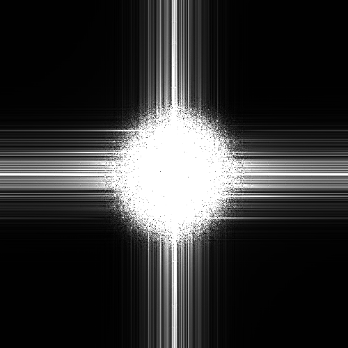

- **Low-Frequency Photograph filtered with Gaussian Kernel:**  

- **Frequency Magnitude of Low-Frequency Photograph filtered with Gaussian Kernel:**  
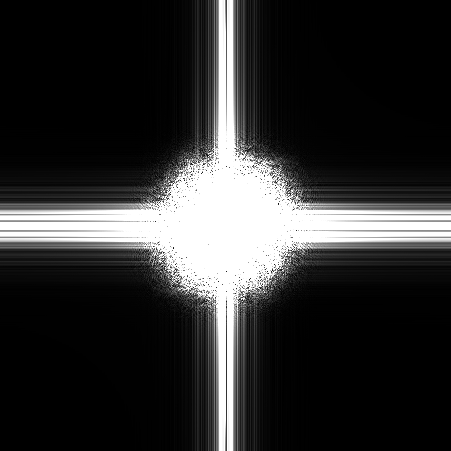

*Observations (Gaussian Filtering):*
- **Spatial Domain:** Both images show blurring, but the effect is more noticeable in the high-frequency image where brick details are softened, while the portrait primarily loses subtle facial texture.
- **Frequency Domain:** Gaussian filtering attenuates high frequencies, visible as reduced energy at the boundaries of the Fourier domain. The high-frequency image shows significant reduction in outer-ring energy, while the low-frequency image shows minor changes since most energy was already concentrated at low frequencies.

- **High-Frequency Photograph filtered with Derivative-of-Gaussian Kernel:**  
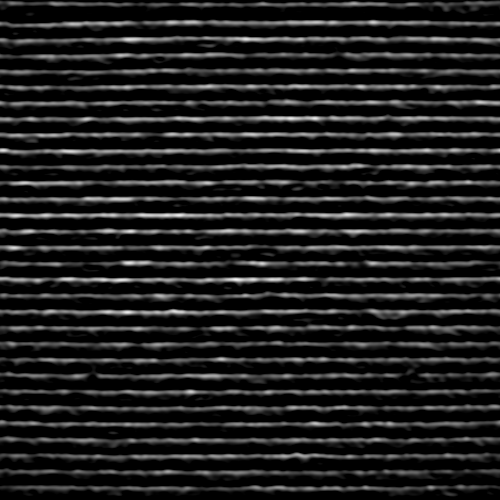

- **Frequency Magnitude of High-Frequency Photograph filtered with Derivative-of-Gaussian Kernel:**  
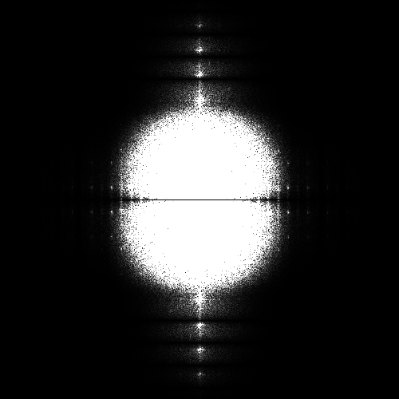

- **Low-Frequency Photograph filtered with Derivative-of-Gaussian Kernel:**  
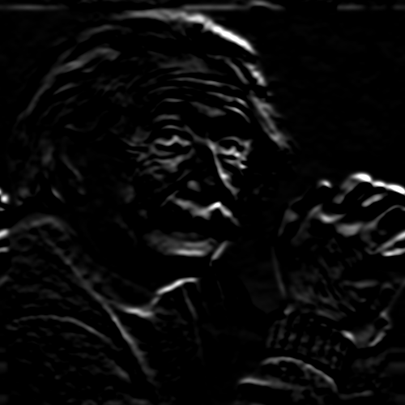

- **Frequency Magnitude of Low-Frequency Photograph filtered with Derivative-of-Gaussian Kernel:**  
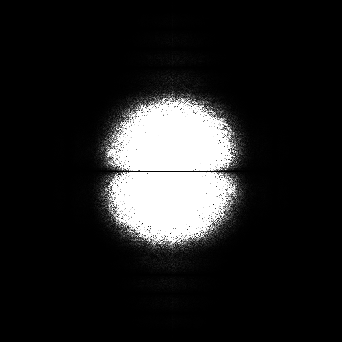

*Observations (DoG Filtering):*
- **Spatial Domain:** The DoG filter acts as an edge detector, enhancing brick edges in the high-frequency image while creating outline effects in the portrait. Note the derivative operation produces negative values, shown here as absolute values.
- **Frequency Domain:** DoG filtering creates a band-pass characteristic attenuating both very low frequencies (smooth regions) and very high frequencies (noise), while preserving medium frequencies corresponding to edges. This is visible as a "donut" pattern in the frequency domain.

## 4: Anti-aliasing

### **Subsampled Images (Half Size):**

- High-Frequency Photograph:  
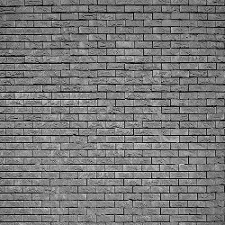

- Frequency Magnitude:  
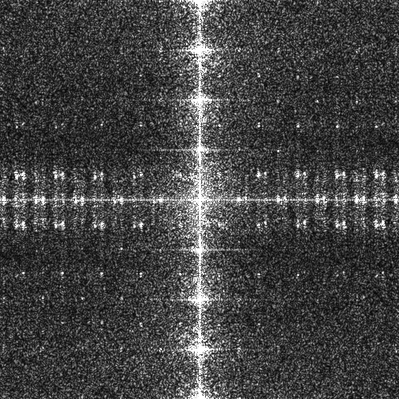

- Low-Frequency Photograph:  

- Frequency Magnitude:  
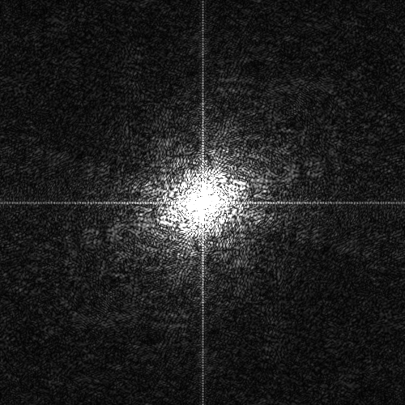

*Observations (2× Downsampling):*
- **Spatial Aliasing:** The brick wall shows Moiré patterns and false low-frequency artifacts because brick spacing approaches the new Nyquist frequency (π/2 radians/pixel). The portrait shows minimal aliasing due to its predominantly low-frequency content.
- **Frequency Domain Evidence:** Aliasing appears as high-frequency components "folding back" into lower frequencies. In the brick image's Fourier domain, energy appears beyond the new Nyquist boundary and creates interference patterns. The portrait's frequency content remains mostly within the safe region.
- **Nyquist Principle:** Without proper anti-aliasing, frequencies above π/2 radians/pixel cannot be represented uniquely and create false low-frequency patterns.

### **Subsampled Images (Quarter Size):**

- High-Frequency Photograph:  
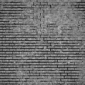

- Frequency Magnitude:  

- Low-Frequency Photograph:  
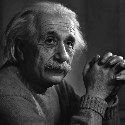

- Frequency Magnitude:  

*Observations (4× Downsampling):*
- **Severe Aliasing:** The brick pattern becomes unrecognizable with strong aliasing artifacts. Even the portrait shows jagged edges along facial contours as medium frequencies now exceed the Nyquist limit (π/4 radians/pixel).
- **Frequency Analysis:** The Fourier domain shows broken patterns with significant energy loss and folding artifacts. High frequencies are completely lost, and medium frequencies create interference patterns.
- **Information Loss:** 4× downsampling without anti-aliasing irretrievably loses high-frequency information, demonstrating the irreversible nature of aliasing.

### **Anti-Aliased Subsampled Images:**

- Half Size High-Frequency Photograph (σ=0.65):  
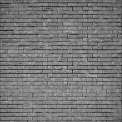

- Frequency Magnitude:  
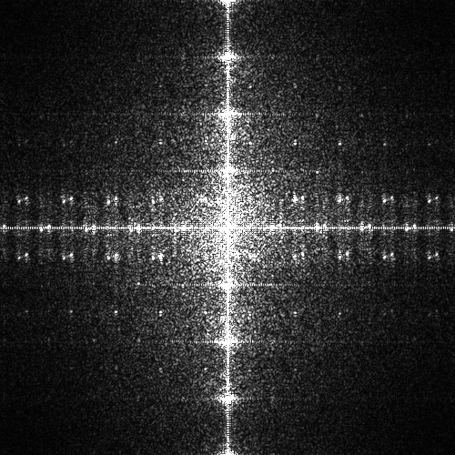

- Quarter Size High-Frequency Photograph (σ=0.57):  
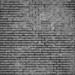

- Frequency Magnitude:  
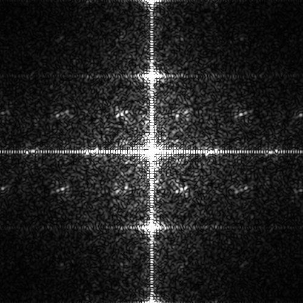

*Anti-Aliasing Analysis:*
- **Filter Design Strategy:** Gaussian filters were designed with cutoff frequencies matching the new Nyquist rates:
  - **2× downsampling:** σ=0.65 provides ≈3dB attenuation at π/2 radians/pixel
  - **4× downsampling:** σ=0.57 provides ≈3dB attenuation at π/4 radians/pixel
  
  The slightly smaller σ for 4× downsampling prevents excessive blurring since the downsampling itself removes more high frequencies.

- **Effectiveness:** Anti-aliasing successfully eliminates Moiré patterns while preserving maximum permissible detail. The brick texture remains recognizable even at quarter size.

- **Frequency Domain Comparison:** Anti-aliased versions show clean frequency spectra with energy properly confined within Nyquist boundaries. No folding artifacts are present, demonstrating proper bandlimiting before sampling.

- **Trade-off:** Anti-aliasing introduces controlled blurring to prevent aliasing a necessary compromise. The optimal σ values balance detail preservation against alias prevention.

## 5: Canny Edge Detection Thresholding

**High-Frequency Photograph Optimal Edges (thresholds [0.1, 0.3]):**  

**High-Frequency Photograph Other Thresholds:**  

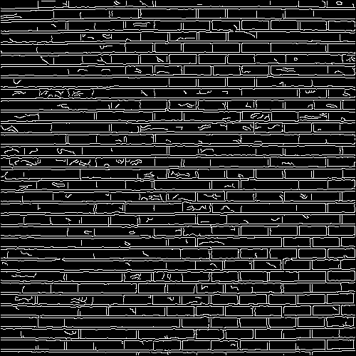
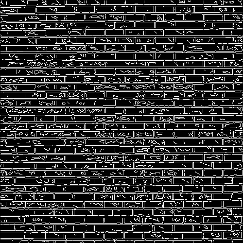
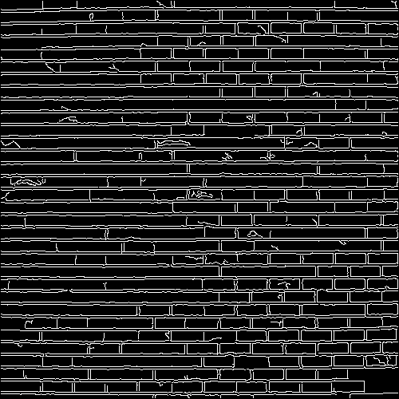

**Low-Frequency Photograph Optimal Edges (thresholds [0.05, 0.15]):**  
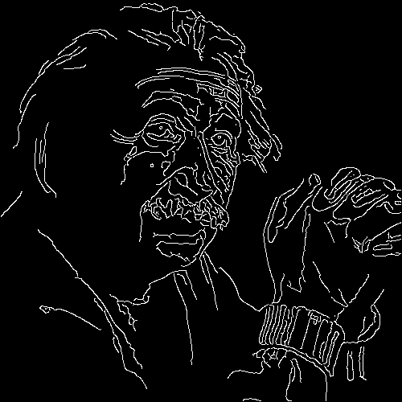

**Low-Frequency Photograph Other Thresholds:**  
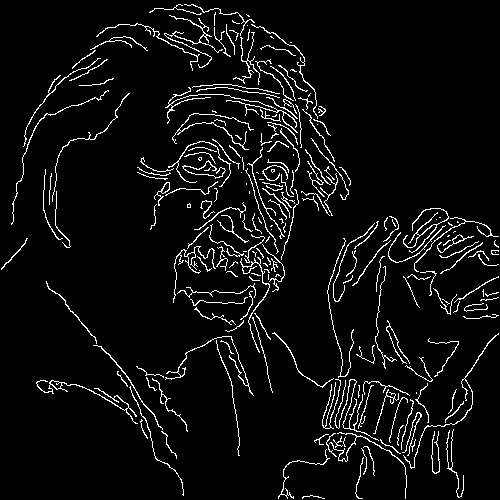
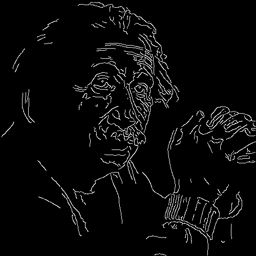
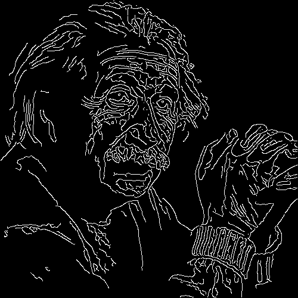
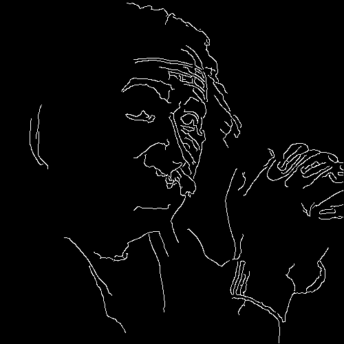

### **Edge Detection Analysis:**

#### **High-Frequency Image (Brick Wall):**
- **Optimal Thresholds [0.1, 0.3]:** Preserves brick boundaries while suppressing noise in mortar regions. The hysteresis thresholding connects meaningful edges without fragmentation.
- **Low-Low Thresholds [0.15, 0.3]:** Introduces excessive noise edges in textured regions while losing some weak brick edges.
- **High-Low Thresholds [0.15, 0.3]:** Similar to low-low with slight variation in noise sensitivity.
- **Low-High Thresholds [0.1, 0.2]:** Creates fragmented edges as the high threshold is too close to the low threshold, reducing hysteresis effectiveness.
- **High-High Thresholds [0.1, 0.5]:** Loses subtle brick edges while preserving only the strongest boundaries.

*Key Insight:* High-frequency images require careful threshold tuning to distinguish true edges from texture noise. The optimal 0.1 low threshold captures weak edges while 0.3 high threshold ensures only significant gradients are connected.

#### **Low-Frequency Image (Portrait):**
- **Optimal Thresholds [0.05, 0.15]:** Captures subtle facial features (eyes, lips, hairline) while maintaining smooth contours. The lower thresholds are necessary due to smaller gradient magnitudes in smooth images.
- **Low-Low Thresholds [0.01, 0.15]:** Introduces noise in smooth skin regions while capturing extremely subtle shading changes.
- **High-Low Thresholds [0.1, 0.15]:** Loses important facial features as the low threshold is too high for the gentle gradients.
- **Low-High Thresholds [0.05, 0.1]:** Creates fragmented edges with poor connectivity.
- **High-High Thresholds [0.05, 0.25]:** Preserves only the strongest edges, missing subtle facial contours.

*Key Insight:* Low-frequency images have smaller gradient magnitudes, requiring lower thresholds. The 5:1 ratio between high and low thresholds provides effective hysteresis for connecting weak edges.

#### **General Principles Observed:**
1. **Threshold Scaling:** High-frequency content requires higher thresholds to suppress texture noise.
2. **Hysteresis Importance:** The ratio between high and low thresholds (typically 2:1 to 3:1) is crucial for edge connectivity.
3. **Content Dependency:** Optimal parameters are image-dependent, demonstrating why adaptive thresholding methods are valuable in practice.
4. **Trade-off:** There's always a balance between edge sensitivity (capturing weak edges) and specificity (avoiding false edges).

## Conclusion

This project successfully demonstrates fundamental image processing concepts through practical implementation. Key takeaways:

1. **Frequency-Space Duality:** Every spatial operation has a corresponding frequency domain interpretation, with filtering operations visibly altering Fourier spectra.

2. **Anti-Aliasing Necessity:** Proper bandlimiting before sampling is essential to prevent irreversible information loss and visual artifacts.

3. **Filter Design Trade-offs:** Gaussian parameters balance smoothing against detail preservation, with applications ranging from noise reduction to anti-aliasing.

4. **Edge Detection Sensitivity:** Canny parameters must be tuned to image content, with high-frequency images requiring higher thresholds and careful hysteresis design.